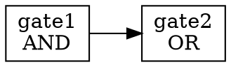

# Backends - Output Generators

Output format generators for MyLogic EDA Tool. These modules convert optimized netlists into various industry-standard output formats.

## 📁 Module Structure

```
backends/
├── __init__.py              # Package initialization
├── dot_generator.py         # DOT graph format generator
├── json_generator.py        # JSON netlist generator
├── verilog_generator.py     # Verilog RTL generator
└── README.md               # This file
```

## 🔧 Modules

### 1. DOT Generator (`dot_generator.py`)

Generates Graphviz DOT format for circuit visualization.

**Class**: `DOTGenerator`

**Key Features**:
- Graph-based netlist representation
- Node and edge generation
- Support for visualization tools (Graphviz)

**Usage**:
```python
from backends.dot_generator import DOTGenerator

generator = DOTGenerator()
dot_content = generator.generate_dot(netlist, "output.dot")
```

**Output Format**:


### 2. JSON Generator (`json_generator.py`)

Generates JSON netlist format for data interchange and analysis.

**Class**: `JSONGenerator`

**Key Features**:
- Structured JSON output
- Human-readable format
- Easy integration with other tools

**Usage**:
```python
from backends.json_generator import JSONGenerator

generator = JSONGenerator()
json_content = generator.generate_json(netlist, "output.json")
```

**Output Format**:
```json
{
  "nodes": [
    {
      "name": "gate1",
      "type": "AND"
    }
  ],
  "connections": [
    {
      "source": "input1",
      "target": "gate1"
    }
  ]
}
```

### 3. Verilog Generator (`verilog_generator.py`)

Generates Verilog RTL output from optimized netlist.

**Class**: `VerilogGenerator`

**Key Features**:
- Standard Verilog RTL output
- Module, port, and wire generation
- Instance generation with connections
- Support for multi-bit signals

**Usage**:
```python
from backends.verilog_generator import VerilogGenerator

generator = VerilogGenerator()
verilog_content = generator.generate_verilog(
    netlist, 
    "output.v",
    top_module="my_design"
)
```

**Output Format**:
```verilog
module my_design (
    input [3:0] a;
    input [3:0] b;
    output [3:0] out;
    wire [3:0] temp;
    
    AND4 gate1 (.A(a), .B(b), .Y(temp));
    OR4 gate2 (.A(temp), .B(b), .Y(out));
endmodule
```

## 📊 Common Features

All generators share common functionality:

1. **Output Directory Management**: Auto-create `outputs/` directory
2. **File Writing**: Save generated content to files
3. **Content Generation**: Return generated content as string
4. **Error Handling**: Graceful handling of missing data

## 🔄 Integration

### With Optimization Flow

```python
from core.optimization.dce import DeadCodeElimination
from backends.verilog_generator import VerilogGenerator

# Optimize netlist
dce = DeadCodeElimination()
optimized_netlist = dce.eliminate_dead_code(netlist)

# Generate output
generator = VerilogGenerator()
verilog_output = generator.generate_verilog(
    optimized_netlist, 
    "optimized.v"
)
```

### Multiple Output Formats

```python
from backends.dot_generator import DOTGenerator
from backends.json_generator import JSONGenerator
from backends.verilog_generator import VerilogGenerator

# Generate multiple formats
dot_gen = DOTGenerator()
json_gen = JSONGenerator()
verilog_gen = VerilogGenerator()

dot_gen.generate_dot(netlist, "circuit.dot")
json_gen.generate_json(netlist, "circuit.json")
verilog_gen.generate_verilog(netlist, "circuit.v")
```

## 📝 Netlist Format

Expected netlist structure:

```python
netlist = {
    'nodes': [
        {'name': 'gate1', 'type': 'AND'},
        {'name': 'gate2', 'type': 'OR'}
    ],
    'connections': [
        {'source': 'input1', 'target': 'gate1'},
        {'source': 'gate1', 'target': 'gate2'}
    ],
    'ports': [
        {'direction': 'input', 'name': 'a', 'width': 4},
        {'direction': 'output', 'name': 'out', 'width': 4}
    ],
    'wires': [
        {'name': 'temp', 'width': 4}
    ],
    'instances': [
        {
            'cell_type': 'AND4',
            'name': 'gate1',
            'connections': {'A': 'a', 'B': 'b', 'Y': 'temp'}
        }
    ]
}
```

## 🎯 Use Cases

### 1. Visualization
Use DOT generator with Graphviz to visualize circuit structure:
```bash
python -c "from backends.dot_generator import DOTGenerator; ..."
dot -Tpng circuit.dot -o circuit.png
```

### 2. Data Exchange
Use JSON generator for tool integration and data analysis:
```python
import json
with open('outputs/circuit.json') as f:
    data = json.load(f)
    # Analyze circuit data
```

### 3. RTL Synthesis
Use Verilog generator for further synthesis with commercial tools:
```bash
# Use generated Verilog with other EDA tools
yosys -p "read_verilog outputs/circuit.v; synth; write_blif output.blif"
```

## 🔍 Output Directory

All generators save files to the `outputs/` directory:

```
outputs/
├── circuit.dot         # DOT graph files
├── circuit.json        # JSON netlist files
└── circuit.v          # Verilog RTL files
```

## ⚠️ Current Status

**Note**: These backend modules are currently **not actively used** in the main MyLogic flow, as Yosys integration handles most output generation tasks. They are kept for:
- Custom output format requirements
- Legacy compatibility
- Educational purposes
- Future extensions

## 🔮 Future Enhancements

Potential improvements:
- BLIF format generator
- EDIF format generator
- SPICE netlist generator
- Liberty library generator
- SystemVerilog output
- Better error handling
- Output format validation

## 📚 References

- Graphviz DOT Language: https://graphviz.org/doc/info/lang.html
- JSON Format: https://www.json.org/
- Verilog HDL: IEEE 1364-2005 Standard

---

**Part of MyLogic EDA Tool v1.0.0**

