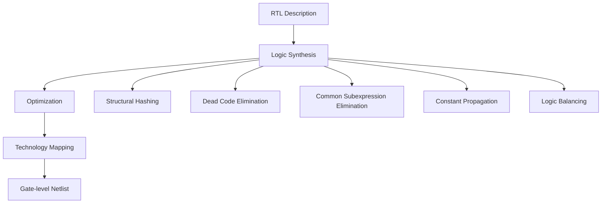

# 📖 GIỚI THIỆU TỔNG QUAN MYLOGIC EDA TOOL

## 🎯 Mục đích tài liệu

Tài liệu này cung cấp hướng dẫn chi tiết về các thuật toán được sử dụng trong **MyLogic EDA Tool** - một công cụ tổng hợp logic mã nguồn mở được phát triển để hỗ trợ học tập và nghiên cứu trong lĩnh vực Electronic Design Automation (EDA).

## 👥 Đối tượng độc giả

- **Sinh viên** ngành Điện tử - Viễn thông, Khoa học Máy tính
- **Nghiên cứu sinh** trong lĩnh vực VLSI và EDA
- **Kỹ sư** muốn tìm hiểu về logic synthesis
- **Giảng viên** giảng dạy về thiết kế chip

## 📋 Cấu trúc tài liệu

Tài liệu được tổ chức theo cấu trúc logic từ cơ bản đến nâng cao:

1. **Nền tảng lý thuyết** - Các khái niệm cơ bản
2. **Thuật toán Logic Synthesis** - Các thuật toán chính
3. **VLSI CAD Algorithms** - Thuật toán thiết kế vật lý
4. **Testing và Verification** - Kiểm thử và xác minh
5. **Benchmarks** - Đánh giá hiệu suất

## 🏗️ Tổng quan về MyLogic EDA Tool

### 📅 Lịch sử phát triển

**MyLogic EDA Tool** được phát triển như một dự án học tập với mục tiêu:

- Tạo ra một công cụ EDA đơn giản, dễ hiểu
- Cung cấp implementation chi tiết các thuật toán cơ bản
- Hỗ trợ việc học tập và nghiên cứu
- Tham khảo từ các công cụ industry như ABC, Yosys

### 🏛️ Kiến trúc hệ thống

```
MyLogic EDA Tool
├── Frontends/          # Parsers (Verilog, etc.)
├── Core/              # Core algorithms
│   ├── Synthesis/     # Logic synthesis algorithms
│   ├── Optimization/  # Optimization algorithms
│   └── VLSI_CAD/     # Physical design algorithms
├── Backends/          # Output formats
├── CLI/              # Command-line interface
├── Tests/            # Test suite
└── Docs/             # Documentation
```

### 🔧 Các thành phần chính

#### 1. **Frontends**
- **Verilog Parser**: Đọc và parse file Verilog
- **Netlist Generator**: Tạo internal representation

#### 2. **Core Algorithms**
- **Logic Synthesis**: Strash, DCE, CSE, ConstProp, Balance
- **VLSI CAD**: BDD, Timing Analysis, Technology Mapping
- **Optimization**: Các thuật toán tối ưu hóa

#### 3. **Backends**
- **Output Formats**: Verilog, JSON, DOT, etc.
- **Visualization**: Graph visualization

#### 4. **CLI Interface**
- **Interactive Shell**: Command-line interface
- **Batch Processing**: Script automation

## 🧮 Logic Synthesis trong EDA

### 🎯 Khái niệm cơ bản

**Logic Synthesis** là quá trình chuyển đổi mô tả logic cấp cao (RTL - Register Transfer Level) thành netlist cấp thấp (gate-level) tối ưu hóa cho một target technology cụ thể.

### 📊 Tầm quan trọng

Logic Synthesis đóng vai trò quan trọng trong thiết kế chip:

1. **Automatic Optimization**: Tự động tối ưu hóa logic
2. **Technology Mapping**: Ánh xạ vào thư viện cell cụ thể
3. **Performance Improvement**: Cải thiện area, timing, power
4. **Design Productivity**: Tăng năng suất thiết kế

### 🔄 Các giai đoạn trong Synthesis Flow



### 🎯 Các mức độ tối ưu hóa

#### 1. **Basic Level**
- Các tối ưu hóa cơ bản
- Loại bỏ duplicates và dead code
- Phù hợp cho learning và simple circuits

#### 2. **Standard Level**
- Tối ưu hóa cân bằng
- Kết hợp nhiều algorithms
- Phù hợp cho most applications

#### 3. **Aggressive Level**
- Tối ưu hóa tối đa
- Advanced algorithms với Don't Cares
- Phù hợp cho production designs

## 🎓 Kiến thức tiên quyết

### 📚 Lý thuyết cần thiết

1. **Boolean Algebra**
   - Boolean functions
   - Logic operations (AND, OR, NOT, XOR)
   - Truth tables và Karnaugh maps

2. **Graph Theory**
   - Directed Acyclic Graphs (DAGs)
   - Topological ordering
   - Path analysis

3. **Data Structures**
   - Trees và graphs
   - Hash tables
   - Queue và stack

### 💻 Kỹ năng lập trình

1. **Python Programming**
   - Object-oriented programming
   - Data structures và algorithms
   - File I/O và parsing

2. **Software Engineering**
   - Code organization
   - Testing và debugging
   - Documentation

## 🔗 Tham khảo và nguồn học tập

### 📖 Tài liệu tham khảo

1. **"Logic Synthesis and Optimization"** - Giovanni De Micheli
2. **"Digital Design and Computer Architecture"** - Harris & Harris
3. **"VLSI Physical Design"** - Andrew B. Kahng

### 🌐 Online Resources

1. **ABC Tool**: https://github.com/YosysHQ/abc
2. **Yosys**: https://github.com/YosysHQ/yosys
3. **OpenROAD**: https://github.com/The-OpenROAD-Project/OpenROAD

### 📚 Academic Papers

1. **"ABC: An Academic Industrial-Strength Verification Tool"**
2. **"Graph-Based Algorithms for Boolean Function Manipulation"** - Bryant
3. **"Binary Decision Diagrams"** - Wegener

## 🚀 Bắt đầu với MyLogic

### 📥 Cài đặt

```bash
# Clone repository
git clone https://github.com/your-username/MyLogic-EDA-Tool.git
cd MyLogic-EDA-Tool

# Install dependencies
pip install -r requirements.txt

# Run tests
python tests/run_all_tests.py
```

### 🎮 Sử dụng cơ bản

```bash
# Chạy interactive shell
python mylogic.py

# Load file Verilog
mylogic> read examples/full_adder.v

# Xem thống kê
mylogic> stats

# Chạy synthesis
mylogic> synthesis standard

# Mô phỏng
mylogic> simulate
```

### 📝 Ví dụ đầu tiên

```verilog
// full_adder.v
module full_adder(a, b, cin, sum, cout);
    input a, b, cin;
    output sum, cout;
    
    assign sum = a ^ b ^ cin;
    assign cout = (a & b) | (cin & (a ^ b));
endmodule
```

## 📊 Metrics và Performance

### 🎯 Các chỉ số đánh giá

1. **Area Optimization**
   - Số lượng gates giảm
   - Diện tích chip tiết kiệm

2. **Timing Optimization**
   - Critical path delay
   - Setup/hold time compliance

3. **Power Optimization**
   - Switching activity
   - Power consumption

### 📈 Benchmark Results

| Algorithm | Node Reduction | Time Improvement | Memory Usage |
|-----------|----------------|------------------|--------------|
| Strash    | 15-30%         | 10-20%          | -5%          |
| DCE       | 20-40%         | 15-25%          | -10%         |
| CSE       | 25-35%         | 20-30%          | -8%          |
| ConstProp | 30-50%         | 25-40%          | -15%         |

## 🔮 Tương lai và phát triển

### 🎯 Roadmap

1. **Phase 1** (Current)
   - Basic logic synthesis algorithms
   - Simple CLI interface
   - Test suite

2. **Phase 2** (Next)
   - Advanced optimization
   - GUI interface
   - More input/output formats

3. **Phase 3** (Future)
   - Physical design algorithms
   - Machine learning integration
   - Cloud deployment

### 🤝 Đóng góp

Chúng tôi hoan nghênh mọi đóng góp từ cộng đồng:

- **Bug reports**: Tìm và báo cáo lỗi
- **Feature requests**: Đề xuất tính năng mới
- **Code contributions**: Đóng góp code
- **Documentation**: Cải thiện tài liệu

## 📞 Liên hệ và hỗ trợ

- **GitHub Issues**: Báo cáo bug và đề xuất feature
- **GitHub Discussions**: Thảo luận và hỏi đáp
- **Email**: [Your contact email]

---

**Lưu ý**: Tài liệu này được cập nhật thường xuyên. Hãy kiểm tra version mới nhất trên GitHub repository.
