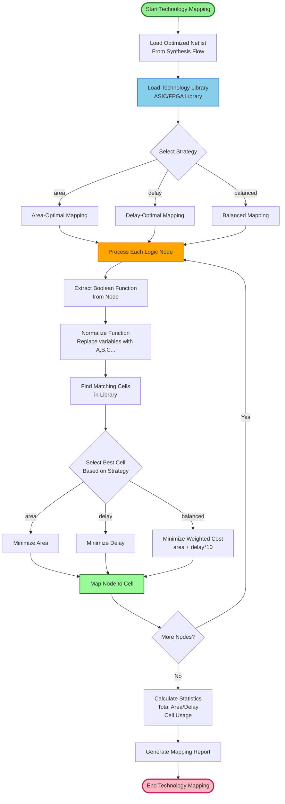

# Technology Mapping Flow - MyLogic EDA Tool

## 📋 Tổng Quan

Technology Mapping là bước quan trọng trong synthesis flow, chuyển đổi logic network (sau optimization) thành các cells từ technology library (ASIC hoặc FPGA).

## 🔄 Luồng Technology Mapping

### Flowchart Tổng Quan



## 📝 Chi Tiết Từng Bước

### 1. **Input: Optimized Netlist**

Sau synthesis flow (Strash, DCE, CSE, ConstProp, Balance), ta có:
- Logic network với các nodes đã được optimize
- Boolean functions cho mỗi node
- Input/output connections

**Example:**
```python
netlist = {
    'nodes': {
        'n1': {'type': 'AND', 'inputs': ['a', 'b'], 'output': 'temp1'},
        'n2': {'type': 'OR', 'inputs': ['c', 'd'], 'output': 'temp2'},
        'n3': {'type': 'XOR', 'inputs': ['temp1', 'temp2'], 'output': 'out'}
    },
    'inputs': ['a', 'b', 'c', 'd'],
    'outputs': ['out']
}
```

### 2. **Load Technology Library**

Load library từ `techlibs/` directory:

**Supported Formats:**
- **Liberty (.lib)**: ASIC standard cells
- **JSON (.json)**: Custom library format
- **Verilog (.v)**: FPGA cells (simcells.v, simlib.v)

**Library Structure:**
```python
library = TechnologyLibrary("fpga_common")
library.cells = {
    'AND2': LibraryCell('AND2', 'AND(A,B)', area=1.5, delay=0.2, ...),
    'OR2': LibraryCell('OR2', 'OR(A,B)', area=1.5, delay=0.2, ...),
    'NAND2': LibraryCell('NAND2', 'NAND(A,B)', area=1.2, delay=0.15, ...),
    ...
}
```

**Auto-loading:**
- `techmap area auto` → Tự động scan `techlibs/`
- `techmap area asic` → Load từ `techlibs/asic/`
- `techmap area fpga_common` → Load từ `techlibs/fpga/common/`

### 3. **Select Mapping Strategy**

#### **3.1. Area-Optimal Mapping**
- **Mục tiêu**: Minimize tổng area
- **Cost function**: `cost = cell.area`
- **Use case**: Khi cần giảm chip size

#### **3.2. Delay-Optimal Mapping**
- **Mục tiêu**: Minimize tổng delay
- **Cost function**: `cost = cell.delay`
- **Use case**: Khi cần tối ưu timing

#### **3.3. Balanced Mapping**
- **Mục tiêu**: Balance giữa area và delay
- **Cost function**: `cost = area + delay * 10`
- **Use case**: General-purpose optimization

### 4. **Process Each Logic Node**

#### **4.1. Extract Boolean Function**

Từ node trong netlist, extract function:
```python
node = {
    'type': 'AND',
    'inputs': ['a', 'b'],
    'output': 'temp1'
}
function = "AND(a,b)"  # Raw function
```

#### **4.2. Normalize Function**

Normalize để match với library cells:
```python
# Input: "AND(a,b)" hoặc "AND(C,D)" hoặc "AND(temp1,temp2)"
# Output: "AND(A,B)"  # Canonical form

def normalize_function(function: str) -> str:
    # Replace variables với A, B, C, ...
    # "AND(a,b)" → "AND(A,B)"
    # "AND(C,D)" → "AND(A,B)"
    # "AND(temp1,temp2)" → "AND(A,B)"
```

**Why normalize?**
- Library cells có function dạng `AND(A,B)`
- Logic nodes có thể dùng bất kỳ variable names
- Normalize để match chính xác

#### **4.3. Find Matching Cells**

Tìm tất cả cells trong library có function match:
```python
normalized_func = "AND(A,B)"
matching_cells = library.function_map.get(normalized_func, [])
# Result: ['AND2', 'AND2X1', 'AND2X2', ...]
```

#### **4.4. Select Best Cell**

Dựa trên strategy, chọn cell tốt nhất:

**Area-Optimal:**
```python
best_cell = min(cells, key=lambda c: c.area)
# Chọn cell có area nhỏ nhất
```

**Delay-Optimal:**
```python
best_cell = min(cells, key=lambda c: c.delay)
# Chọn cell có delay nhỏ nhất
```

**Balanced:**
```python
best_cell = min(cells, key=lambda c: c.area + c.delay * 10)
# Chọn cell có weighted cost nhỏ nhất
```

### 5. **Map Node to Cell**

Gán cell cho node:
```python
node.mapped_cell = best_cell
node.mapping_cost = best_cell.area  # hoặc delay, hoặc weighted cost
```

### 6. **Calculate Statistics**

Sau khi map tất cả nodes:
- **Total Area**: Tổng area của tất cả mapped cells
- **Total Delay**: Tổng delay của tất cả mapped cells
- **Cell Usage**: Số lượng mỗi loại cell được sử dụng
- **Mapping Success Rate**: Tỷ lệ nodes được map thành công

### 7. **Generate Report**

Output report bao gồm:
- Mapping strategy
- Total nodes vs mapped nodes
- Total area/delay
- Cell usage breakdown
- Node-to-cell mapping details

## 🔧 Implementation Details

### Code Flow

```python
# 1. Load library
library = load_library_from_file("techlibs/fpga/common/cells.lib")

# 2. Create mapper
mapper = TechnologyMapper(library)

# 3. Add logic nodes from netlist
for node_id, node_data in netlist['nodes'].items():
    logic_node = LogicNode(
        name=node_id,
        function=f"{node_data['type']}({','.join(node_data['inputs'])})",
        inputs=node_data['inputs'],
        output=node_data['output']
    )
    mapper.add_logic_node(logic_node)

# 4. Perform mapping
results = mapper.perform_technology_mapping(strategy="balanced")

# 5. Print report
mapper.print_mapping_report(results)
```

### Function Normalization Example

```python
# Input functions từ netlist:
"AND(a,b)"        → normalize → "AND(A,B)"
"OR(C,D)"         → normalize → "OR(A,B)"
"XOR(temp1,temp2)" → normalize → "XOR(A,B)"
"NAND(x,y)"       → normalize → "NAND(A,B)"

# Library cells có:
"AND(A,B)"  → matches với tất cả AND functions
"OR(A,B)"   → matches với tất cả OR functions
```

### Cell Selection Example

**Library có nhiều AND cells:**
- `AND2`: area=1.5, delay=0.2
- `AND2X1`: area=1.3, delay=0.25
- `AND2X2`: area=1.8, delay=0.15

**Area-Optimal**: Chọn `AND2X1` (area nhỏ nhất = 1.3)
**Delay-Optimal**: Chọn `AND2X2` (delay nhỏ nhất = 0.15)
**Balanced**: Chọn dựa trên `area + delay*10`

## 📊 Output Format

### Mapping Results

```python
{
    'strategy': 'balanced',
    'total_area': 15.5,
    'total_delay': 2.3,
    'mapped_nodes': 10,
    'total_nodes': 10,
    'mapping_success_rate': 1.0
}
```

### Statistics

```python
{
    'total_nodes': 10,
    'mapped_nodes': 10,
    'unmapped_nodes': 0,
    'mapping_success_rate': 1.0,
    'cell_usage': {
        'AND2': 3,
        'OR2': 2,
        'XOR2': 1,
        'NAND2': 4
    },
    'unique_cells_used': 4
}
```

## 🎯 Usage Examples

### Command Line

```bash
python mylogic.py
mylogic> read examples/full_adder.v
mylogic> synthesis standard
mylogic> techmap balanced fpga_common
```

### Python API

```python
from parsers import parse_verilog
from core.synthesis.synthesis_flow import run_complete_synthesis
from core.technology_mapping.technology_mapping import (
    TechnologyMapper, load_library_from_file
)

# Parse và synthesize
netlist = parse_verilog("examples/full_adder.v")
optimized = run_complete_synthesis(netlist, "standard")

# Load library
library = load_library_from_file("techlibs/fpga/common/cells.lib")

# Technology mapping
mapper = TechnologyMapper(library)
# ... add nodes ...
results = mapper.perform_technology_mapping("balanced")
mapper.print_mapping_report(results)
```

## 🔍 Supported Libraries

### ASIC Libraries
- `techlibs/asic/standard_cells.lib` - Liberty format

### FPGA Libraries
- `techlibs/fpga/common/` - Common FPGA cells (cells.lib)
- `techlibs/fpga/anlogic/` - Anlogic FPGA
- `techlibs/fpga/gowin/` - Gowin FPGA
- `techlibs/fpga/ice40/` - Lattice iCE40
- `techlibs/fpga/intel/` - Intel/Altera FPGA
- `techlibs/fpga/lattice/` - Lattice FPGA
- `techlibs/fpga/xilinx/` - Xilinx FPGA

## ⚙️ Advanced Features

### 1. **Function Matching**
- Normalize functions để match với library
- Hỗ trợ complex functions (AOI, OAI, MUX, etc.)

### 2. **Multi-Strategy Support**
- Area-optimal: Minimize area
- Delay-optimal: Minimize delay
- Balanced: Balance area và delay

### 3. **Library Auto-Detection**
- Tự động scan `techlibs/` directory
- Auto-load library phù hợp

### 4. **DFF Mapping**
- Hỗ trợ mapping flip-flops (DFF_N, DFF_P, etc.)
- Từ `techlibs/fpga/common/cells.lib`

## 📈 Performance Metrics

| Strategy | Optimization Target | Use Case |
|----------|-------------------|----------|
| **Area-Optimal** | Minimize area | Chip size constrained |
| **Delay-Optimal** | Minimize delay | Timing critical |
| **Balanced** | Balance area/delay | General purpose |

## 🔗 Integration với Synthesis Flow

Technology Mapping là bước cuối cùng trong synthesis flow:

```
Verilog → Parse → Strash → DCE → CSE → ConstProp → Balance → Technology Mapping → Mapped Netlist
```

Sau technology mapping, ta có:
- Logic network đã được map vào technology cells
- Area và delay estimates
- Ready cho placement & routing

## 📚 Ví Dụ Thực Tế

### Example: Simple AND-OR Circuit

**Input Verilog:**
```verilog
module test_techmap(
    input a, b, c, d,
    output out1, out2
);
    wire temp1 = a & b;
    wire temp2 = c | d;
    assign out1 = temp1 ^ temp2;
    assign out2 = (a & b) | (c & d);
endmodule
```

**After Synthesis:**
- Node n1: `AND(a,b)` → temp1
- Node n2: `OR(c,d)` → temp2
- Node n3: `XOR(temp1,temp2)` → out1
- Node n4: `OR(AND(a,b), AND(c,d))` → out2

**Technology Mapping Process:**

1. **Node n1: AND(a,b)**
   - Normalize: `AND(a,b)` → `AND(A,B)`
   - Find cells: `['AND2', 'AND2X1', 'AND2X2']`
   - Select (area-optimal): `AND2X1` (area=1.3, delay=0.25)
   - Map: n1 → AND2X1

2. **Node n2: OR(c,d)**
   - Normalize: `OR(c,d)` → `OR(A,B)`
   - Find cells: `['OR2', 'OR2X1', 'OR2X2']`
   - Select (area-optimal): `OR2X1` (area=1.3, delay=0.25)
   - Map: n2 → OR2X1

3. **Node n3: XOR(temp1,temp2)**
   - Normalize: `XOR(temp1,temp2)` → `XOR(A,B)`
   - Find cells: `['XOR2', 'XOR2X1']`
   - Select: `XOR2X1` (area=2.0, delay=0.25)
   - Map: n3 → XOR2X1

**Result:**
- Total Area: 4.6 (1.3 + 1.3 + 2.0)
- Total Delay: 0.75
- Mapping Success: 100%

## 📝 Notes

- Technology mapping chỉ map được các nodes có function match với library
- Nếu không tìm thấy matching cell, node sẽ không được map
- Function normalization là critical để match chính xác
- Library phải có đầy đủ cells cần thiết

