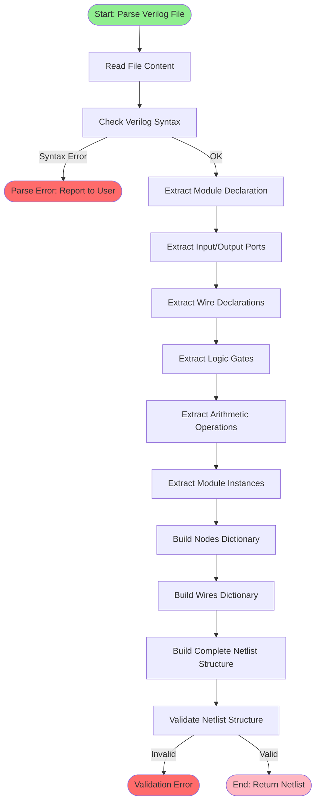
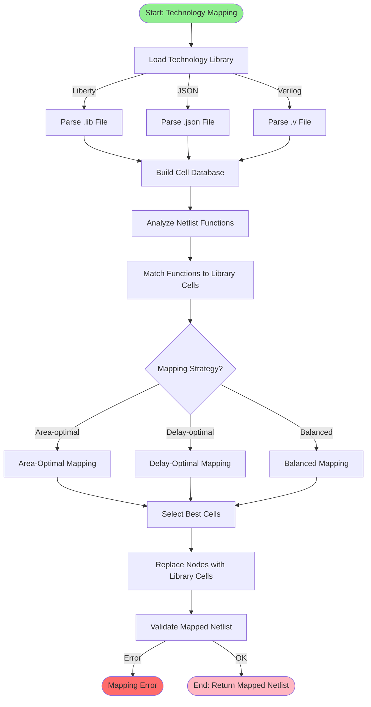
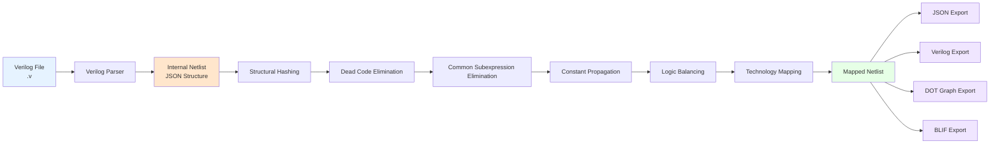
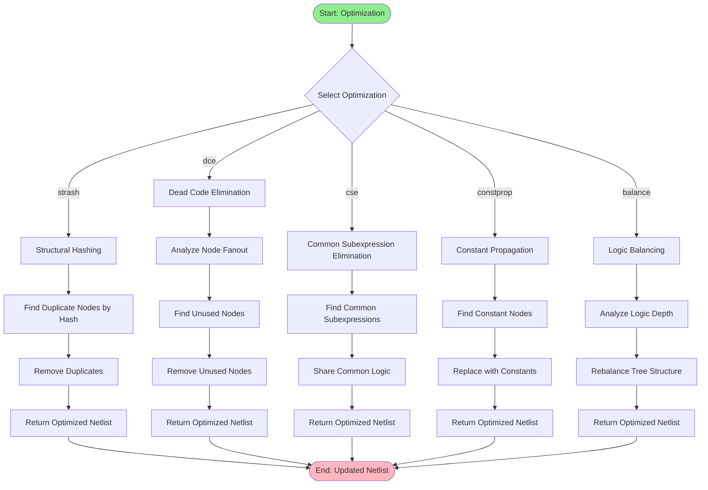
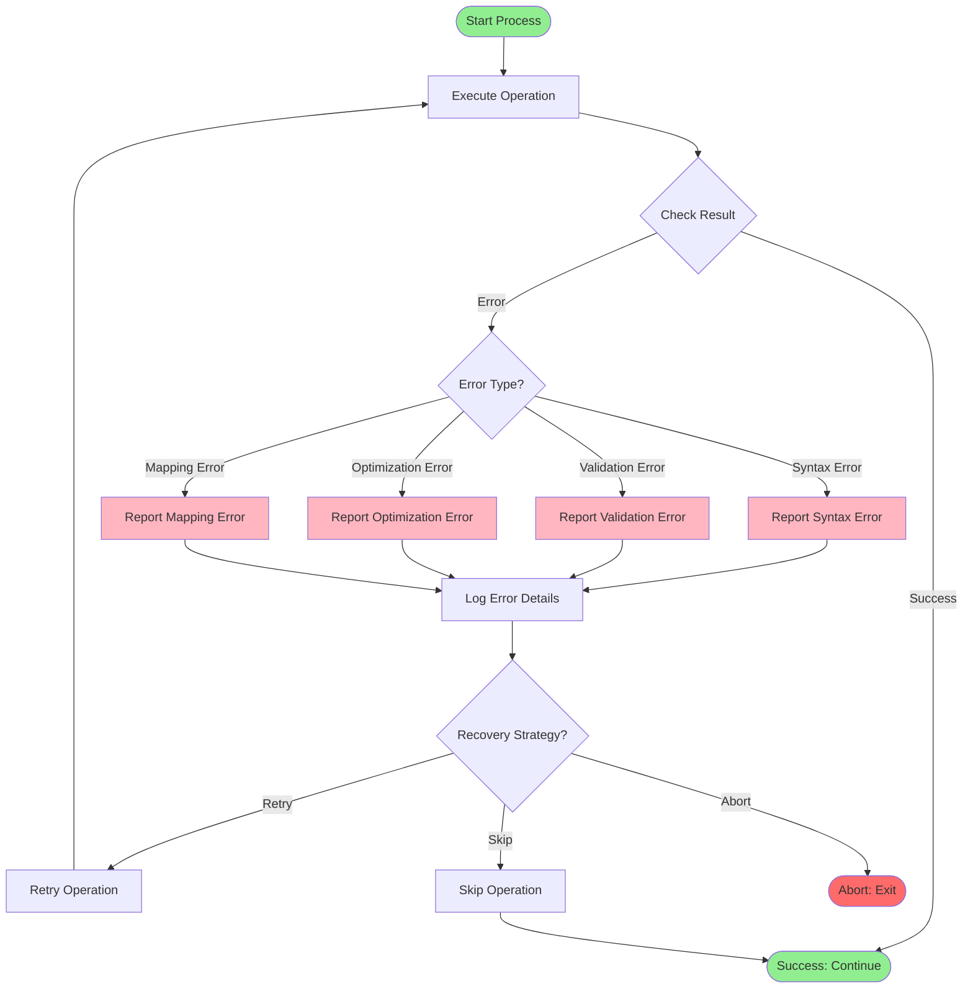
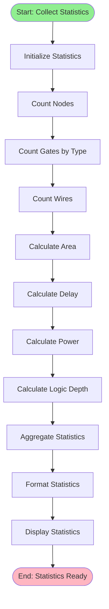

# Verilog Processing Flow - MyLogic EDA Tool

## Tổng Quan

Tài liệu này mô tả chi tiết flow xử lý file Verilog trong MyLogic EDA Tool, từ input đến output, dựa trên các chuẩn EDA industry và best practices.

## ⚠️ QUAN TRỌNG: Hiểu về 2 Loại "Mode"

Trong MyLogic EDA Tool có **2 loại "mode" khác nhau** cần phân biệt rõ:

### 1. **Entry Mode** (Chế độ vào - được chọn TRƯỚC khi đọc file)
Đây là cách bạn khởi động tool, được xác định bởi **command line arguments**:

- **`--file <file.v>`**: Auto Load Mode
  - Tự động đọc file và load vào shell
  - Sau đó vào Interactive Shell để làm việc
  
- **`--synthesize <level>`**: Auto Synthesis Mode  
  - Tự động chạy synthesis và export kết quả
  - **KHÔNG** vào Interactive Shell, chạy xong rồi thoát
  
- **Không có argument**: Interactive Shell Mode
  - Khởi động shell trống, chưa có file nào
  - Dùng lệnh `read` để load file sau

### 2. **Processing Mode** (Chế độ xử lý - Vector vs Scalar)
Đây là cách tool xử lý file, được xác định **SAU KHI đọc file**:

- **Vector Mode**: Xử lý các signal có bit-width (ví dụ: `[3:0]`, `[7:0]`)
  - Tự động detect nếu file có `[3:0]`, `[2:0]`, etc.
  - Hoặc force bằng `--vector`
  
- **Scalar Mode**: Xử lý các signal 1-bit
  - Tự động detect nếu file không có vector declarations
  - Hoặc force bằng `--scalar`

### Ví dụ Flow:

```
1. User chạy: python mylogic.py --file design.v
   → Entry Mode = "Auto Load"
   
2. Tool đọc file design.v
   → Tìm thấy [3:0] trong file
   → Processing Mode = "Vector"
   
3. Tool load file vào Vector Shell
   → User có thể dùng các lệnh: synthesis, strash, dce, etc.
```

### So sánh:

| Entry Mode | Khi nào dùng? | Processing Mode được chọn khi nào? |
|------------|---------------|-------------------------------------|
| `--file` | Muốn load file ngay và làm việc tương tác | **SAU KHI** đọc file content |
| `--synthesize` | Muốn chạy synthesis tự động rồi thoát | **SAU KHI** đọc file content |
| (không có) | Muốn shell trống, load file sau | Khi dùng lệnh `read` trong shell |

## 1. Mode Selection Explained (Giải thích chọn Mode)

### 1.0. Mode Selection Flow - Chi tiết

Flowchart này giải thích **KHI NÀO** và **NHƯ THẾ NÀO** chọn mode:

```mermaid
flowchart TD
    Start([User chạy lệnh]) --> CheckArgs{Check Command Line<br/>Arguments}
    
    CheckArgs -->|Có --file?| HasFile{Có --synthesize?}
    CheckArgs -->|Không có --file| NoFile[Entry Mode:<br/>Interactive Shell<br/>Shell trống, chưa có file]
    
    HasFile -->|Có --synthesize| EntryMode1[Entry Mode:<br/>Auto Synthesis<br/>Chạy synthesis rồi thoát]
    HasFile -->|Không có --synthesize| EntryMode2[Entry Mode:<br/>Auto Load<br/>Load file vào shell]
    
    EntryMode1 --> ReadFile1[ĐỌC FILE<br/>design.v]
    EntryMode2 --> ReadFile2[ĐỌC FILE<br/>design.v]
    NoFile --> WaitCmd[Chờ lệnh read]
    WaitCmd -->|User gõ: read file.v| ReadFile3[ĐỌC FILE<br/>file.v]
    
    ReadFile1 --> ScanContent1[Quét nội dung file<br/>Tìm [3:0], [2:0], etc.]
    ReadFile2 --> ScanContent2[Quét nội dung file<br/>Tìm [3:0], [2:0], etc.]
    ReadFile3 --> ScanContent3[Quét nội dung file<br/>Tìm [3:0], [2:0], etc.]
    
    ScanContent1 --> HasVector1{Có vector<br/>declarations?}
    ScanContent2 --> HasVector2{Có vector<br/>declarations?}
    ScanContent3 --> HasVector3{Có vector<br/>declarations?}
    
    HasVector1 -->|Có [3:0]| ProcMode1[Processing Mode:<br/>VECTOR<br/>Xử lý multi-bit]
    HasVector1 -->|Không có| ProcMode2[Processing Mode:<br/>SCALAR<br/>Xử lý 1-bit]
    
    HasVector2 -->|Có [3:0]| ProcMode3[Processing Mode:<br/>VECTOR]
    HasVector2 -->|Không có| ProcMode4[Processing Mode:<br/>SCALAR]
    
    HasVector3 -->|Có [3:0]| ProcMode5[Processing Mode:<br/>VECTOR]
    HasVector3 -->|Không có| ProcMode6[Processing Mode:<br/>SCALAR]
    
    ProcMode1 --> Parse1[Parse Verilog]
    ProcMode2 --> Parse1
    ProcMode3 --> Parse2[Parse Verilog]
    ProcMode4 --> Parse2
    ProcMode5 --> Parse3[Parse Verilog]
    ProcMode6 --> Parse3
    
    Parse1 --> Action1[Chạy Synthesis<br/>Export kết quả<br/>Thoát]
    Parse2 --> Action2[Load vào Shell<br/>Sẵn sàng cho lệnh]
    Parse3 --> Action2
    
    Action2 --> Ready[Shell Ready<br/>Có thể dùng lệnh]
    
    style Start fill:#90EE90
    style CheckArgs fill:#87CEEB
    style EntryMode1 fill:#87CEEB
    style EntryMode2 fill:#87CEEB
    style NoFile fill:#87CEEB
    style HasVector1 fill:#FFA500
    style HasVector2 fill:#FFA500
    style HasVector3 fill:#FFA500
    style ProcMode1 fill:#FFA500
    style ProcMode2 fill:#FFA500
    style ProcMode3 fill:#FFA500
    style ProcMode4 fill:#FFA500
    style ProcMode5 fill:#FFA500
    style ProcMode6 fill:#FFA500
    style Ready fill:#90EE90
```

### Ví dụ cụ thể:

**Ví dụ 1**: `python mylogic.py --file adder.v`
```
1. Entry Mode = "Auto Load" (vì có --file)
2. Đọc file adder.v
3. Tìm thấy: input [3:0] A, B
4. Processing Mode = "Vector" (vì có [3:0])
5. Load vào Vector Shell
6. User có thể dùng lệnh: synthesis, strash, etc.
```

**Ví dụ 2**: `python mylogic.py --file full_adder.v --synthesize standard`
```
1. Entry Mode = "Auto Synthesis" (vì có --synthesize)
2. Đọc file full_adder.v
3. Không tìm thấy [3:0], chỉ có: input a, b, cin
4. Processing Mode = "Scalar" (vì không có vector)
5. Chạy 5 bước synthesis
6. Export kết quả
7. Thoát (KHÔNG vào shell)
```

**Ví dụ 3**: `python mylogic.py` (sau đó gõ `read design.v`)
```
1. Entry Mode = "Interactive Shell" (không có --file)
2. Shell khởi động trống
3. User gõ: read design.v
4. Đọc file design.v
5. Tìm thấy [7:0] data
6. Processing Mode = "Vector"
7. Load vào shell
8. User có thể dùng lệnh
```

## 2. Main Processing Flowchart

### 2.1. Complete Verilog Processing Flow

**LƯU Ý**: Flowchart này thể hiện 2 loại mode:
- **Entry Mode** (màu xanh): Chọn TRƯỚC khi đọc file (command line)
- **Processing Mode** (màu cam): Chọn SAU KHI đọc file (auto-detect hoặc force)

```mermaid
flowchart TD
    Start([Start: User Command]) --> Entry{Entry Mode?<br/>Command Line Argument}
    
    Entry -->|--file design.v| AutoLoad[Auto Load Mode<br/>Tự động load file]
    Entry -->|python mylogic.py<br/>no args| Interactive[Interactive Shell Mode<br/>Shell trống]
    Entry -->|--synthesize| AutoSynth[Auto Synthesis Mode<br/>Chạy rồi thoát]
    
    AutoLoad --> ReadFile1[Đọc File Content<br/>design.v]
    Interactive --> WaitCmd[Wait for Commands<br/>Chưa có file]
    AutoSynth --> ReadFile2[Đọc File Content<br/>design.v]
    
    ReadFile1 --> Detect1[File Type Detection<br/>Tìm [3:0], [2:0], etc.]
    ReadFile2 --> Detect2[File Type Detection<br/>Tìm [3:0], [2:0], etc.]
    
    Detect1 -->|Có [3:0]| VectorMode1[Processing Mode: Vector]
    Detect1 -->|Không có| ScalarMode1[Processing Mode: Scalar]
    Detect2 -->|Có [3:0]| VectorMode2[Processing Mode: Vector]
    Detect2 -->|Không có| ScalarMode2[Processing Mode: Scalar]
    
    VectorMode1 --> Parse1[Parse Verilog File]
    ScalarMode1 --> Parse1
    VectorMode2 --> Parse2[Parse Verilog File]
    ScalarMode2 --> Parse2
    
    Parse1 --> Validate1[Validate Syntax]
    Parse2 --> Validate2[Validate Syntax]
    
    Validate1 -->|Error| Error1[Report Syntax Error]
    Validate2 -->|Error| Error2[Report Syntax Error]
    Validate1 -->|OK| Netlist1[Build Netlist Structure]
    Validate2 -->|OK| Netlist2[Build Netlist Structure]
    
    Netlist1 --> SynthFlow[Run Complete Synthesis Flow<br/>5 bước optimization]
    Netlist2 --> LoadShell[Load Netlist vào Shell<br/>Sẵn sàng cho lệnh]
    
    LoadShell --> WaitCmd
    WaitCmd --> Cmd{Command?}
    
    Cmd -->|read file.v| Read[Read New File<br/>Quay lại Detect]
    Cmd -->|synthesis| SynthFlow
    Cmd -->|strash| Strash[Structural Hashing]
    Cmd -->|dce| DCE[Dead Code Elimination]
    Cmd -->|cse| CSE[Common Subexpression Elimination]
    Cmd -->|constprop| ConstProp[Constant Propagation]
    Cmd -->|balance| Balance[Logic Balancing]
    Cmd -->|techmap| TechMap[Technology Mapping]
    Cmd -->|place| Place[Placement]
    Cmd -->|route| Route[Routing]
    Cmd -->|timing| Timing[Static Timing Analysis]
    Cmd -->|export| Export[Export Results]
    Cmd -->|stats| Stats[Show Statistics]
    Cmd -->|simulate| Sim[Simulate Circuit]
    Cmd -->|exit| End([End])
    
    Read --> Parse3[Parse File]
    Parse3 --> Netlist3[Build Netlist]
    Netlist3 --> LoadShell
    
    Strash --> Update1[Update Netlist]
    DCE --> Update2[Update Netlist]
    CSE --> Update3[Update Netlist]
    ConstProp --> Update4[Update Netlist]
    Balance --> Update5[Update Netlist]
    TechMap --> Update6[Update Netlist]
    Place --> Update7[Update Netlist]
    Route --> Update8[Update Netlist]
    Timing --> Update9[Update Netlist]
    
    Update1 --> WaitCmd
    Update2 --> WaitCmd
    Update3 --> WaitCmd
    Update4 --> WaitCmd
    Update5 --> WaitCmd
    Update6 --> WaitCmd
    Update7 --> WaitCmd
    Update8 --> WaitCmd
    Update9 --> WaitCmd
    
    SynthFlow --> Step1[Step 1: Structural Hashing]
    Step1 --> Step2[Step 2: Dead Code Elimination]
    Step2 --> Step3[Step 3: Common Subexpression Elimination]
    Step3 --> Step4[Step 4: Constant Propagation]
    Step4 --> Step5[Step 5: Logic Balancing]
    Step5 --> Summary[Print Synthesis Summary]
    Summary --> ExportAuto[Auto Export Results]
    ExportAuto --> End
    
    Export --> FileType{Export Format?}
    FileType -->|JSON| ExportJSON[Export JSON]
    FileType -->|Verilog| ExportVerilog[Export Verilog]
    FileType -->|DOT| ExportDOT[Export DOT Graph]
    FileType -->|BLIF| ExportBLIF[Export BLIF]
    
    ExportJSON --> WaitCmd
    ExportVerilog --> WaitCmd
    ExportDOT --> WaitCmd
    ExportBLIF --> WaitCmd
    
    Stats --> WaitCmd
    Sim --> WaitCmd
    
    Error1 --> End
    Error2 --> End
    
    style Start fill:#90EE90
    style End fill:#FFB6C1
    style Entry fill:#87CEEB
    style AutoLoad fill:#87CEEB
    style Interactive fill:#87CEEB
    style AutoSynth fill:#87CEEB
    style Detect1 fill:#FFA500
    style Detect2 fill:#FFA500
    style VectorMode1 fill:#FFA500
    style VectorMode2 fill:#FFA500
    style ScalarMode1 fill:#FFA500
    style ScalarMode2 fill:#FFA500
    style SynthFlow fill:#87CEEB
    style Error1 fill:#FF6B6B
    style Error2 fill:#FF6B6B
```

## 3. Detailed Synthesis Flow

### 3.1. Complete Logic Synthesis Flow

```mermaid
flowchart TD
    SynthStart([Start Synthesis Flow]) --> Validate[Validate Input Netlist]
    Validate -->|Invalid| ValidationError([Error: Invalid Netlist])
    Validate -->|Valid| Init[Initialize Statistics Tracker]
    
    Init --> Strash[Step 1: Structural Hashing]
    Strash --> StrashProcess[Find Duplicate Nodes]
    StrashProcess --> StrashRemove[Remove Duplicates]
    StrashRemove --> StrashStats[Update Strash Statistics]
    
    StrashStats --> DCE[Step 2: Dead Code Elimination]
    DCE --> DCEAnalyze[Analyze Node Usage]
    DCEAnalyze --> DCEFind[Find Unused Nodes]
    DCEFind --> DCERemove[Remove Unused Nodes]
    DCERemove --> DCEStats[Update DCE Statistics]
    
    DCEStats --> CSE[Step 3: Common Subexpression Elimination]
    CSE --> CSEFind[Find Common Subexpressions]
    CSEFind --> CSEShare[Share Common Logic]
    CSEShare --> CSEStats[Update CSE Statistics]
    
    CSEStats --> ConstProp[Step 4: Constant Propagation]
    ConstProp --> ConstPropFind[Find Constant Nodes]
    ConstPropFind --> ConstPropReplace[Replace with Constants]
    ConstPropReplace --> ConstPropStats[Update ConstProp Statistics]
    
    ConstPropStats --> Balance[Step 5: Logic Balancing]
    Balance --> BalanceAnalyze[Analyze Logic Depth]
    BalanceAnalyze --> BalanceRebuild[Rebalance Tree Structure]
    BalanceRebuild --> BalanceStats[Update Balance Statistics]
    
    BalanceStats --> CalcFinal[Calculate Final Metrics]
    CalcFinal --> PrintSummary[Print Synthesis Summary]
    PrintSummary --> SynthEnd([End: Return Optimized Netlist])
    
    style SynthStart fill:#90EE90
    style SynthEnd fill:#FFB6C1
    style ValidationError fill:#FF6B6B
    style Strash fill:#87CEEB
    style DCE fill:#87CEEB
    style CSE fill:#87CEEB
    style ConstProp fill:#87CEEB
    style Balance fill:#87CEEB
```



## 4. Verilog Parsing Flow

### 4.1. File Parsing and Netlist Construction



## 5. Technology Mapping Flow

### 5.1. Technology Mapping Process



## 6. Data Flow Diagram

### 6.1. Data Transformation Pipeline



## 7. Optimization Algorithms Flow

### 7.1. Individual Optimization Process



## 8. Error Handling Flow

### 8.1. Error Detection and Recovery



## 9. Performance Metrics Flow

### 9.1. Statistics Collection and Reporting



## 10. References

### 10.1. Industry Standards

Flowchart này được thiết kế dựa trên:

1. **EDA Industry Standards**:
   - RTL to GDSII flow (Wikipedia EDA)
   - Logic Synthesis flow (Synopsys, Cadence)
   - Technology Mapping standards (Liberty format)

2. **Academic References**:
   - VLSI CAD algorithms
   - Logic optimization techniques
   - Boolean function minimization

3. **MyLogic Implementation**:
   - `mylogic.py` - Entry point và mode selection
   - `synthesis_flow.py` - Complete synthesis flow
   - `vector_shell.py` - Interactive CLI
   - `parsers/` - Verilog parsing

### 10.2. Flow Characteristics

- **Entry Points**: 3 modes (Auto Load, Interactive, Auto Synthesis)
- **Synthesis Steps**: 5 optimization algorithms
- **Output Formats**: JSON, Verilog, DOT, BLIF
- **Error Handling**: Comprehensive error detection and recovery
- **Statistics**: Real-time metrics collection

## 11. Usage Examples

### 11.1. Quick Synthesis Example

```bash
# Auto synthesis mode
python mylogic.py --file design.v --synthesize standard

# Flow:
# 1. Parse Verilog → Netlist
# 2. Run 5-step synthesis
# 3. Export results
```

### 10.2. Interactive Workflow Example

```bash
# Interactive mode
python mylogic.py --file design.v

# Commands:
# > read design.v
# > synthesis
# > stats
# > export design_optimized.json
# > exit
```

### 10.3. Step-by-Step Optimization

```bash
# Interactive step-by-step
python mylogic.py --file design.v

# Commands:
# > strash
# > dce
# > cse
# > constprop
# > balance
# > stats
```

---

**Document Version**: 1.0  
**Last Updated**: 2025-12-12  
**Author**: MyLogic EDA Tool Development Team

