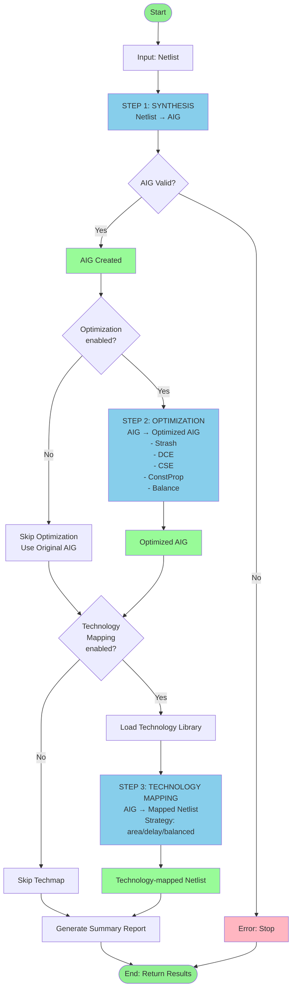
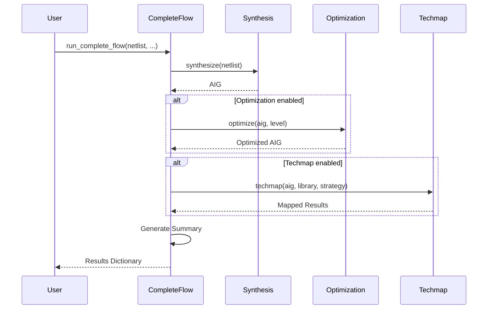

# Complete Flow Flowchart

Flow chart cho Complete Flow: Synthesis → Optimization → Technology Mapping

## Mermaid Flowchart



## ASCII Art Flowchart

```
                    ┌─────────────┐
                    │   START     │
                    │  run_       │
                    │ complete_   │
                    │ flow()      │
                    └──────┬──────┘
                           │
                           ▼
                    ┌─────────────┐
                    │   Input:    │
                    │  Netlist    │
                    │  Dictionary │
                    └──────┬──────┘
                           │
                           ▼
    ┌──────────────────────────────────────────────┐
    │  STEP 1: SYNTHESIS                           │
    │  Netlist → AIG                               │
    │  ──────────────────────                      │
    │  • Validate netlist                          │
    │  • Convert to AIG                            │
    │  • Create AIG nodes                          │
    └──────────────────┬───────────────────────────┘
                       │
                       ▼
                ┌──────────────┐
                │ AIG Created  │
                └──────┬───────┘
                       │
                       ▼
    ┌──────────────────────────────────────────────┐
    │  STEP 2: OPTIMIZATION?                       │
    │  (enable_optimization)                       │
    └──────┬──────────────────┬────────────────────┘
           │                  │
        Yes│                  │No
           │                  │
           ▼                  ▼
    ┌─────────────┐   ┌──────────────┐
    │ Optimize    │   │ Skip Opt     │
    │ AIG         │   │ Use Original │
    │ ──────────  │   │ AIG          │
    │ • Strash    │   └──────┬───────┘
    │ • DCE       │          │
    │ • CSE       │          │
    │ • ConstProp │          │
    │ • Balance   │          │
    └──────┬──────┘          │
           │                 │
           └────────┬────────┘
                    │
                    ▼
    ┌──────────────────────────────────────────────┐
    │  STEP 3: TECHNOLOGY MAPPING?                 │
    │  (enable_techmap)                            │
    └──────┬──────────────────┬────────────────────┘
           │                  │
        Yes│                  │No
           │                  │
           ▼                  ▼
    ┌─────────────┐   ┌──────────────┐
    │ Load        │   │ Skip Techmap │
    │ Library     │   └──────┬───────┘
    └──────┬──────┘          │
           │                 │
           ▼                 │
    ┌─────────────┐          │
    │ Technology  │          │
    │ Mapping     │          │
    │ ──────────  │          │
    │ • AIG →     │          │
    │   LogicNodes│          │
    │ • Map to    │          │
    │   cells     │          │
    │ • Strategy: │          │
    │   area/     │          │
    │   delay/    │          │
    │   balanced  │          │
    └──────┬──────┘          │
           │                 │
           └────────┬────────┘
                    │
                    ▼
            ┌───────────────┐
            │   SUMMARY     │
            │   REPORT      │
            └───────┬───────┘
                    │
                    ▼
            ┌───────────────┐
            │  RETURN       │
            │  RESULTS      │
            │  Dictionary   │
            └───────┬───────┘
                    │
                    ▼
                ┌───────┐
                │  END  │
                └───────┘
```

## Data Flow

```
Netlist
  │
  ├─[Synthesis]──→ AIG
  │                   │
  │                   ├─[Optimization]──→ Optimized AIG
  │                   │                      │
  │                   │                      └─[Techmap]──→ Mapped Netlist
  │                   │
  │                   └───────────────────────[Techmap]──→ Mapped Netlist
  │
  └────────────────────────────────────────────→ Results Dictionary
```

## Sequence Diagram



