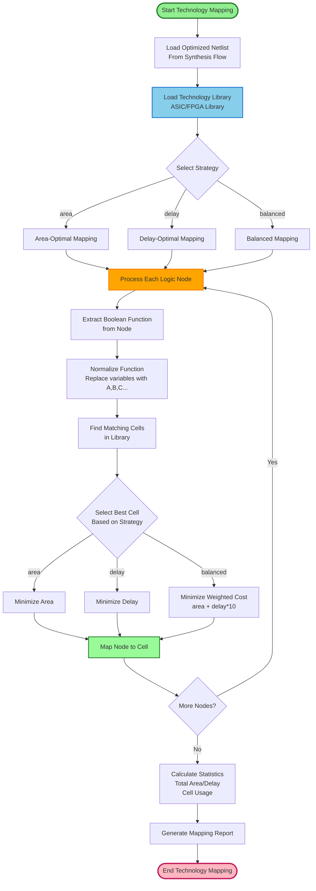
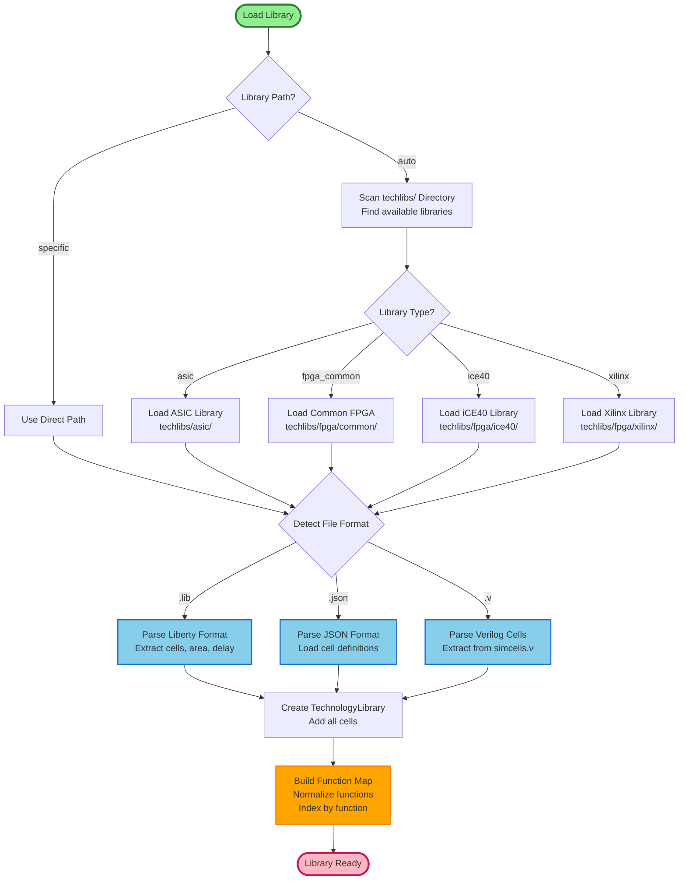
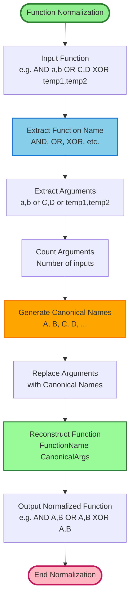
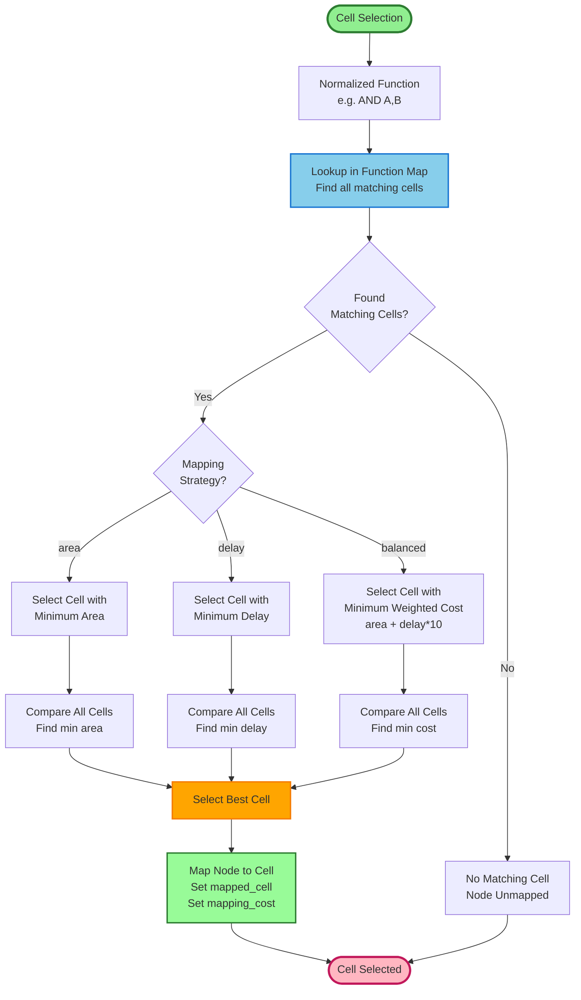
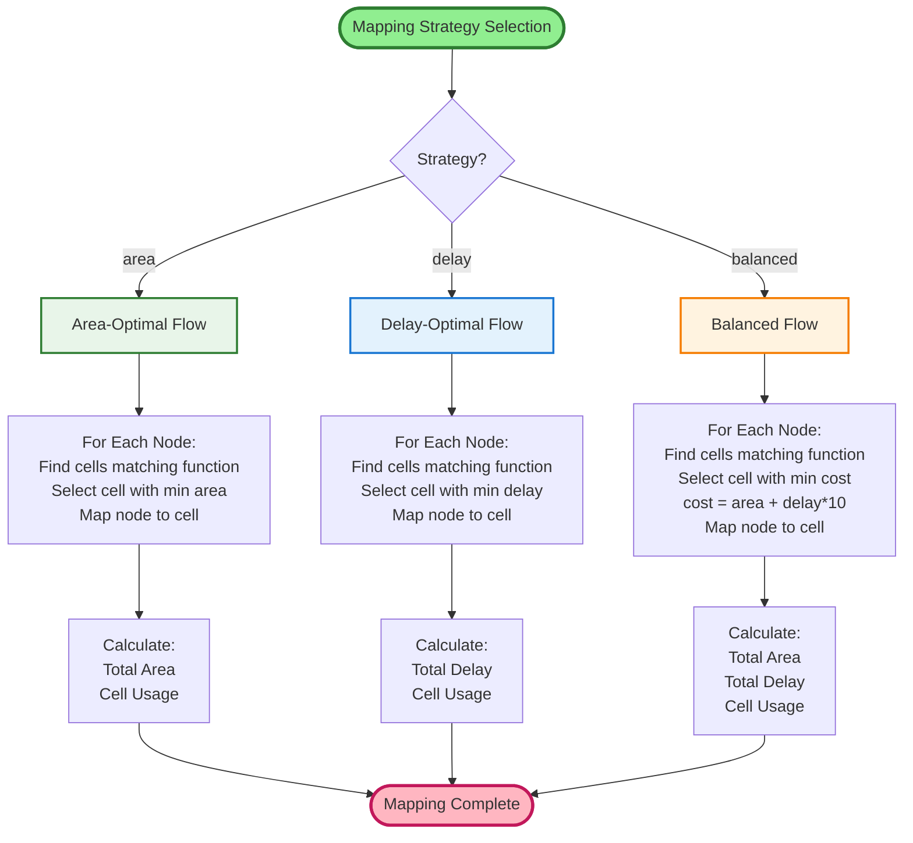
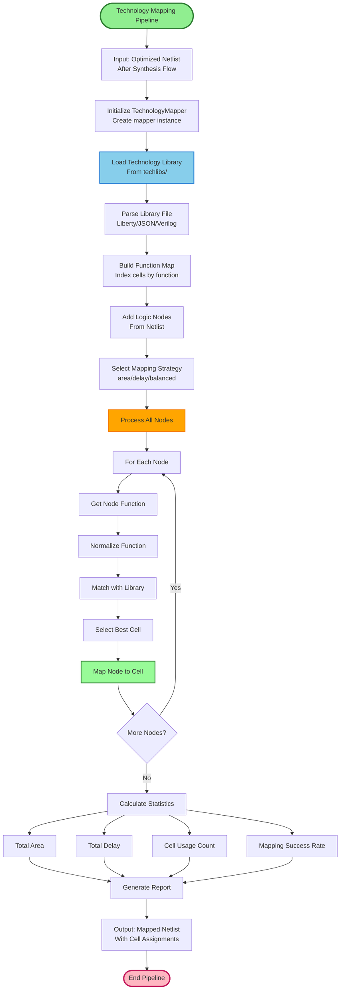

# Technology Mapping Flow - Detailed Flowchart

## 1. TECHNOLOGY MAPPING FLOW (OVERVIEW)

## 2. LIBRARY LOADING FLOW

## 3. FUNCTION NORMALIZATION FLOW

## 4. CELL SELECTION FLOW

## 5. MAPPING STRATEGIES COMPARISON

## 6. COMPLETE TECHNOLOGY MAPPING PIPELINE

